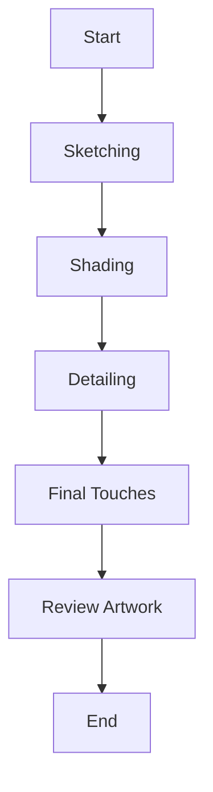
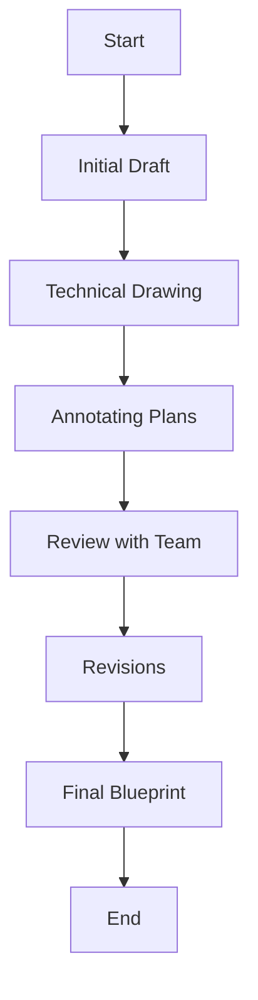
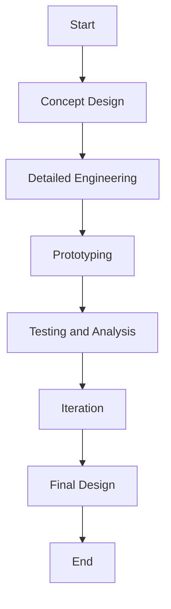

# Pencil Master 2.0 Test Plan


## Table of Contents

1. [Purpose and Scope](#purpose-and-scope)
2. [Stakeholders](#stakeholders)
3. [Test Categories](#test-categories)
4. [Detailed Test Cases](#detailed-test-cases)
   - [Physical Attributes](#physical-attributes)
   - [Performance](#performance)
   - [Durability](#durability)
   - [User Experience](#user-experience)
   - [Safety](#safety)
   - [Environmental Impact](#environmental-impact)
   - [Packaging Verification](#packaging-verification)
   - [Phalange Analysis](#phalange-analysis)
5. [Sample Files and Data](#sample-files-and-data)
   - [Sample CSV Data](#sample-csv-data)
   - [Sample Video Files](#sample-video-files)
   - [Sample PDF Files](#sample-pdf-files)
6. [User Journeys](#user-journeys)
7. [Sign-Off](#sign-off)

## Purpose and Scope

- **Purpose:** Ensure the Pencil Master 2.0 meets all required specifications and quality standards for various professional use cases.
- **Scope:** Includes all aspects of the Pencil Master 2.0, from physical properties to performance during use, focusing on specific professional needs.

## Stakeholders

- **Project Manager:** Responsible for overall project delivery and ensuring milestones are met.
- **Product Owner:** Ensures the product meets the market requirements and customer needs.
- **Quality Assurance Team:** Conducts the tests and ensures the product meets quality standards.
- **Legal Team:** Ensures the product and packaging meet all legal requirements.
- **Marketing Team:** Ensures the branding and packaging align with marketing strategies.
- **Design Team:** Provides design specifications and ensures the product meets aesthetic standards.
- **Engineering Team:** Provides technical specifications and supports the testing process.

## Test Categories

- Physical Attributes
- Performance
- Durability
- User Experience
- Safety
- Environmental Impact
- Packaging Verification
- Phalange Analysis

## Detailed Test Cases

### Physical Attributes

1. **Measure Length**
   - **Type of Test:** Physical Measurement
   - **Sample Files:** None
   - **Machine Used:** Precision ruler or digital caliper
   - **Steps:**
     - Use a precise ruler or caliper to measure the length.
   - **Expected Result:** Length should be within the specified range (e.g., 7.5 inches ± 0.1 inches).

2. **Measure Diameter**
   - **Type of Test:** Physical Measurement
   - **Sample Files:** None
   - **Machine Used:** Digital caliper
   - **Steps:**
     - Use a caliper to measure the diameter at multiple points along the pencil.
   - **Expected Result:** Diameter should be consistent and within the specified range (e.g., 7 mm ± 0.2 mm).

3. **Weight Check**
   - **Type of Test:** Physical Measurement
   - **Sample Files:** None
   - **Machine Used:** Precision scale
   - **Steps:**
     - Use a precision scale to weigh the pencil.
   - **Expected Result:** Weight should be within the specified range (e.g., 5 grams ± 0.5 grams).

### Performance

4. **Writing Smoothness**
   - **Type of Test:** User Testing, Automated Testing
   - **Sample Files:** `writing_smoothness_video.mp4`
   - **Machine Used:** High-speed camera for recording, robotic arm for automated writing
   - **Steps:**
     - Write on various paper types and evaluate.
     - Record the writing session and analyze the smoothness.
   - **Expected Result:** Writing should be smooth without skipping.

5. **Graphite Flow Consistency**
   - **Type of Test:** User Testing, Automated Testing
   - **Sample Files:** `graphite_flow_video.mp4`
   - **Machine Used:** High-speed camera for recording, robotic arm for automated writing
   - **Steps:**
     - Continuous writing for a specified period.
     - Record the writing session and analyze graphite flow.
   - **Expected Result:** Graphite should flow consistently without breaks.

6. **Darkness of Mark**
   - **Type of Test:** User Testing, Automated Testing
   - **Sample Files:** None
   - **Machine Used:** Image analysis software
   - **Steps:**
     - Write samples and compare against standard.
   - **Expected Result:** Mark should be within the specified darkness range.

### Durability

7. **Graphite Breakage Resistance**
   - **Type of Test:** Physical Testing
   - **Sample Files:** None
   - **Machine Used:** Universal testing machine (UTM)
   - **Steps:**
     - Apply pressure at different points and assess breakage.
   - **Expected Result:** Graphite should resist breaking under normal pressure.

8. **Wood Casing Strength**
   - **Type of Test:** Physical Testing
   - **Sample Files:** None
   - **Machine Used:** Universal testing machine (UTM)
   - **Steps:**
     - Apply pressure and check for splintering or breaking.
   - **Expected Result:** Wood should not splinter or break under normal use.

9. **Impact Resistance**
   - **Type of Test:** Physical Testing
   - **Sample Files:** None
   - **Machine Used:** Drop tester
   - **Steps:**
     - Drop the pencil from a specified height and inspect for damage.
   - **Expected Result:** Pencil should not suffer significant damage from standard drops.

10. **Long-Term Use Consistency**
    - **Type of Test:** User Testing
    - **Sample Files:** None
    - **Machine Used:** High-speed camera for recording long-term use
    - **Steps:**
      - Regularly use the pencil for an extended period and evaluate performance.
    - **Expected Result:** Pencil should maintain performance over time.

### User Experience

11. **Grip Comfort**
    - **Type of Test:** User Testing
    - **Sample Files:** `grip_comfort_video.mp4`
    - **Machine Used:** High-speed camera for recording user feedback sessions
    - **Steps:**
      - Use the Pencil Master 2.0 for prolonged periods and assess comfort.
      - Record user feedback and video sessions.
    - **Expected Result:** Pencil should remain comfortable during use.

12. **Balance and Handling**
    - **Type of Test:** User Testing
    - **Sample Files:** None
    - **Machine Used:** High-speed camera for recording handling tests
    - **Steps:**
      - Perform various writing and drawing tasks.
    - **Expected Result:** Pencil should be well-balanced and easy to handle.

### Safety

13. **Toxicity Check**
    - **Type of Test:** Chemical Analysis
    - **Sample Files:** `toxicity_report.csv`
    - **Machine Used:** Mass spectrometer, gas chromatograph
    - **Steps:**
      - Perform chemical analysis of materials.
    - **Expected Result:** Materials should be certified non-toxic.

14. **Physical Safety**
    - **Type of Test:** Visual and Tactile Inspection
    - **Sample Files:** None
    - **Machine Used:** None (manual inspection)
    - **Steps:**
      - Inspect for sharp edges, splinters, etc.
    - **Expected Result:** Pencil should be free of physical hazards.

### Environmental Impact

15. **Sustainability of Wood**
    - **Type of Test:** Document Review
    - **Sample Files:** `supplier_certifications.pdf`
    - **Machine Used:** None (manual review)
    - **Steps:**
      - Review supplier certifications and conduct audits.
    - **Expected Result:** Wood should come from sustainable sources.

16. **Recyclability**
    - **Type of Test:** Material Composition Analysis
    - **Sample Files:** None
    - **Machine Used:** Material analyzer
    - **Steps:**
      - Analyze the composition and recycling processes.
    - **Expected Result:** Pencil materials should be recyclable.

17. **Eco-friendliness of Paint and Eraser**
    - **Type of Test:** Environmental Impact Analysis
    - **Sample Files:** None
    - **Machine Used:** Environmental impact analysis software
    - **Steps:**
      - Perform environmental impact analysis.
    - **Expected Result:** Paint and eraser should be eco-friendly.

### Packaging Verification

18. **Legal Disclaimers and Branding Details**
    - **Type of Test:** Document Review, Visual Inspection
    - **Sample Files:** `packaging_specs.pdf`, `packaging_photos.zip`
    - **Machine Used:** None (manual review)
    - **Steps:**
      - Compare the packaging against the provided specifications.
    - **Expected Result:** Packaging should include all required legal disclaimers and branding details.

### Phalange Analysis

19. **Phalange Analysis After Usage**
    - **Type of Test:** Biomechanical Analysis
    - **Sample Files:** `phalange_analysis_video.mp4`, `phalange_data.csv`
    - **Machine Used:** High-speed camera for recording hand movements, motion capture sensors
    - **Steps:**
      - Record the hand movements of users while using the Pencil Master 2.0.
      - Analyze the impact on phalanges (finger bones) using motion capture and biomechanical analysis software.
    - **Expected Result:** Minimal strain on phalanges, ensuring comfortable use over extended periods.

## Sample Files and Data

### Sample CSV Data

#### **toxicity_report.csv**

```csv
Material

,Component,Test,Result,Units,Threshold,Pass/Fail
Graphite,Lead,Toxicity,0.01,ppm,0.05,Pass
Wood,Formaldehyde,Toxicity,0.02,ppm,0.1,Pass
Eraser,Phthalates,Toxicity,0.01,ppm,0.1,Pass
Paint,Cadmium,Toxicity,0.005,ppm,0.01,Pass
```

#### **phalange_data.csv**

```csv
Timestamp,Finger,Joint,Angle,Force
0.00,Index,Proximal,10.5,0.2
0.01,Index,Proximal,11.0,0.2
0.02,Index,Proximal,10.8,0.3
0.00,Middle,Proximal,12.5,0.3
0.01,Middle,Proximal,12.7,0.3
0.02,Middle,Proximal,12.6,0.4
```

### Sample Video Files

- **writing_smoothness_video.mp4**: A video recording of a user writing with the Pencil Master 2.0 on different types of paper.
- **graphite_flow_video.mp4**: A video recording of continuous writing with the Pencil Master 2.0 to analyze graphite flow consistency.
- **grip_comfort_video.mp4**: A video recording of users using the Pencil Master 2.0 for extended periods to assess grip comfort.
- **phalange_analysis_video.mp4**: A video recording of the hand movements of users while using the Pencil Master 2.0, used for biomechanical analysis.

### Sample PDF Files

- **supplier_certifications.pdf**: Document containing certifications from suppliers confirming the sustainability of the wood used in Pencil Master 2.0.
- **packaging_specs.pdf**: Specifications provided by the legal and marketing teams detailing the required legal disclaimers and branding details for the packaging.
- **packaging_photos.zip**: A ZIP file containing photos of the packaging from different angles to verify the presence of legal disclaimers and branding details.

## User Journeys

### Artist Workflow



### Architect Workflow



### Engineer Workflow



### Detailed Workflow for Artists

1. **Sketching**
   - Use Pencil Master 2.0 for initial outlines.
   - Test smoothness and consistency of lines.

2. **Shading**
   - Apply varying pressure for different shading effects.
   - Analyze the uniformity of graphite flow.

3. **Detailing**
   - Focus on intricate details.
   - Check precision and control of the pencil.

4. **Final Touches**
   - Add highlights and finishing strokes.
   - Ensure the pencil maintains sharpness.

5. **Review Artwork**
   - Assess the overall quality of the drawing.
   - Look for any issues in graphite consistency or pencil performance.

### Detailed Workflow for Architects

1. **Initial Draft**
   - Create rough sketches of design concepts.
   - Evaluate ease of use for quick sketches.

2. **Technical Drawing**
   - Develop detailed architectural plans.
   - Test accuracy and sharpness of lines.

3. **Annotating Plans**
   - Add notes and dimensions to drawings.
   - Check clarity and readability of annotations.

4. **Review with Team**
   - Present drafts to the team for feedback.
   - Make quick adjustments as needed.

5. **Revisions**
   - Incorporate feedback and refine the plans.
   - Ensure pencil performance during prolonged use.

6. **Final Blueprint**
   - Finalize the detailed architectural plans.
   - Verify that all annotations and details are clear.

### Detailed Workflow for Engineers

1. **Concept Design**
   - Create preliminary sketches of engineering concepts.
   - Test the pencil's ability to handle initial design work.

2. **Detailed Engineering**
   - Develop detailed technical drawings and specifications.
   - Ensure precision in line work and annotations.

3. **Prototyping**
   - Use the drawings to create prototypes.
   - Test durability and consistency during extended use.

4. **Testing and Analysis**
   - Analyze prototypes and make notes on drawings.
   - Ensure clarity and precision in annotations.

5. **Iteration**
   - Refine designs based on test results.
   - Test the pencil's performance during multiple iterations.

6. **Final Design**
   - Finalize the detailed engineering design.
   - Verify that all technical details are clear and precise.

## Sign-Off

The following stakeholders have reviewed and approved this test plan:

- **Project Manager:** 
  - Name: [Name]
  - Signature: ______________________
  - Date: _______________

- **Product Owner:** 
  - Name: [Name]
  - Signature: ______________________
  - Date: _______________

- **Quality Assurance Lead:** 
  - Name: [Name]
  - Signature: ______________________
  - Date: _______________

- **Legal Representative:** 
  - Name: [Name]
  - Signature: ______________________
  - Date: _______________

- **Marketing Lead:** 
  - Name: [Name]
  - Signature: ______________________
  - Date: _______________

- **Design Lead:** 
  - Name: [Name]
  - Signature: ______________________
  - Date: _______________

- **Engineering Lead:** 
  - Name: [Name]
  - Signature: ______________________
  - Date: _______________
