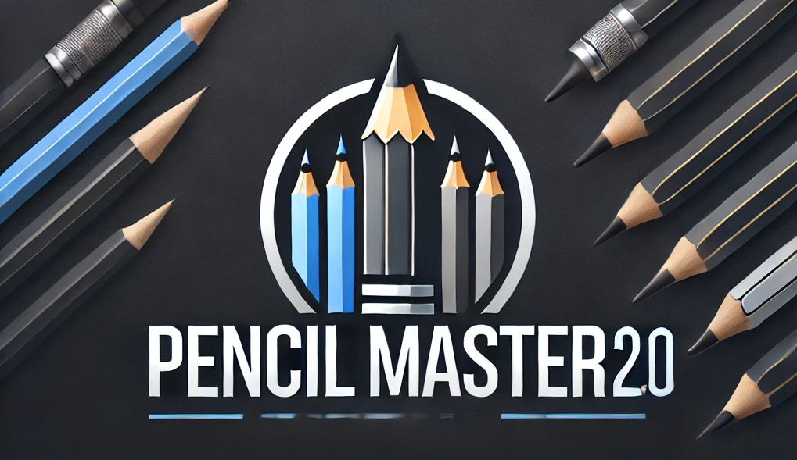
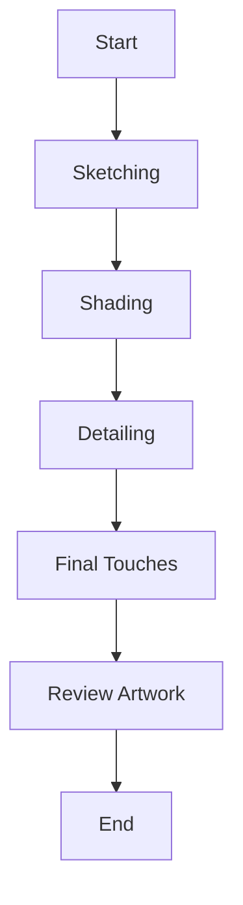
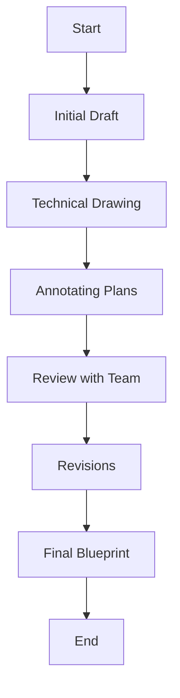
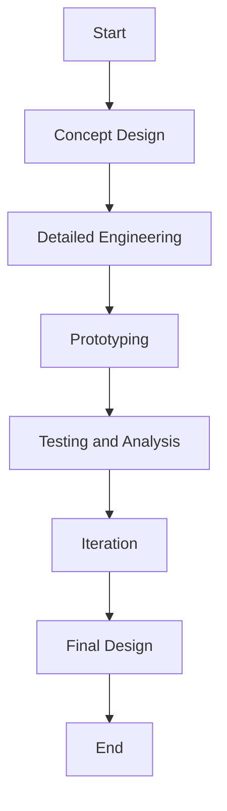

# Pencil Master 2.0 Test Plan



## Table of Contents

1. [Purpose and Scope](#purpose-and-scope)
2. [Stakeholders](#stakeholders)
3. [Test Categories](#test-categories)
4. [Detailed Test Cases](#detailed-test-cases)
5. [Sample Files and Data](#sample-files-and-data)
6. [User Journeys](#user-journeys)
7. [Sign-Off](#sign-off)

## Purpose and Scope

- **Purpose:** Ensure the Pencil Master 2.0 meets all required specifications and quality standards for various professional use cases.
- **Scope:** Includes all aspects of the Pencil Master 2.0, from physical properties to performance during use, focusing on specific professional needs.

## Stakeholders

- **Project Manager:** Responsible for overall project delivery and ensuring milestones are met.
- **Product Owner:** Ensures the product meets market requirements and customer needs.
- **Quality Assurance Team:** Conducts the tests and ensures the product meets quality standards.
- **Legal Team:** Ensures the product and packaging meet all legal requirements.
- **Marketing Team:** Ensures the branding and packaging align with marketing strategies.
- **Design Team:** Provides design specifications and ensures the product meets aesthetic standards.
- **Engineering Team:** Provides technical specifications and supports the testing process.

## Test Categories

- Physical Attributes
- Performance
- Durability
- User Experience
- Safety
- Environmental Impact
- Packaging Verification
- Phalange Analysis
- Color Consistency
- Eraser Quality
- Built-in APSOLESENSE
- Accessibility Testing
- Internationalization and Cultural Sensitivity
- Elemental Analysis

## Detailed Test Cases

```csv
ID,Category,Test Name,Type,Tools,Steps,Expected Result
TC001,Physical Attributes,Measure Length,Physical Measurement,Precision ruler or digital caliper,Measure the length using the specified tools.,Length within 7.5 inches ± 0.1 inches.
TC002,Physical Attributes,Measure Diameter,Physical Measurement,Digital caliper,Measure the diameter at multiple points.,Diameter consistent and within 7 mm ± 0.2 mm.
TC003,Physical Attributes,Weight Check,Physical Measurement,Precision scale,Weigh the pencil using a precision scale.,Weight within 5 grams ± 0.5 grams.
TC004,Performance,Writing Smoothness,User Testing, Automated Testing,High-speed camera, robotic arm,Write on various paper types and analyze smoothness.,Smooth writing without skipping.
TC005,Performance,Graphite Flow Consistency,User Testing, Automated Testing,High-speed camera, robotic arm,Continuous writing and analysis.,Consistent graphite flow without breaks.
TC006,Performance,Darkness of Mark,User Testing, Automated Testing,Image analysis software,Write samples and compare against standard.,Mark within specified darkness range.
TC007,Durability,Graphite Breakage Resistance,Physical Testing,Universal testing machine (UTM),Apply pressure and assess breakage.,Graphite resists breaking under normal pressure.
TC008,Durability,Wood Casing Strength,Physical Testing,Universal testing machine (UTM),Apply pressure and check for splintering.,Wood does not splinter or break under normal use.
TC009,Durability,Impact Resistance,Physical Testing,Drop tester,Drop the pencil from a specified height and inspect.,No significant damage from standard drops.
TC010,Durability,Long-Term Use Consistency,User Testing,High-speed camera,Regular use and evaluation.,Maintains performance over time.
TC011,User Experience,Grip Comfort,User Testing,High-speed camera,Prolonged use and assessment.,Comfortable grip.
TC012,User Experience,Balance and Handling,User Testing,High-speed camera,Various tasks and handling.,Well-balanced and easy to handle.
TC013,Safety,Toxicity Check,Chemical Analysis,Mass spectrometer, gas chromatograph,Analyze materials.,Materials certified non-toxic.
TC014,Safety,Physical Safety,Visual and Tactile Inspection,Manual inspection,Inspect for hazards.,Free of physical hazards.
TC015,Environmental Impact,Sustainability of Wood,Document Review,Manual review,Review certifications and conduct audits.,Wood from sustainable sources.
TC016,Environmental Impact,Recyclability,Material Composition Analysis,Material analyzer,Analyze composition and recycling processes.,Materials recyclable.
TC017,Environmental Impact,Eco-friendliness of Paint and Eraser,Environmental Impact Analysis,Environmental impact analysis software,Perform analysis.,Eco-friendly materials.
TC018,Packaging Verification,Legal Disclaimers and Branding Details,Document Review, Visual Inspection,Manual review,Compare packaging with specifications.,Includes all required disclaimers and details.
TC019,Phalange Analysis,Phalange Analysis After Usage,Biomechanical Analysis,High-speed camera, motion capture sensors,Record and analyze hand movements.,Minimal strain on phalanges.
TC020,Sample Files and Data,Review Toxicity Report,Document Review,Manual review,Check the toxicity report CSV file.,All materials are below the toxicity threshold.
TC021,Sample Files and Data,Analyze Phalange Data,Data Analysis,Statistical software,Analyze phalange data CSV file for force and angle.,Minimal force and consistent angles for comfort.
TC022,Sample Files and Data,Review Video Files,Visual Inspection,Video player,Review video files for writing smoothness, graphite flow, and grip comfort.,Videos demonstrate expected results.
TC023,Sample Files and Data,Verify Supplier Certifications,Document Review,Manual review,Review supplier certifications PDF file.,Certifications confirm sustainable sourcing.
TC024,Sample Files and Data,Check Packaging Photos,Visual Inspection,Image viewer,Review packaging photos ZIP file.,Packaging meets branding and legal requirements.
TC025,User Journeys,Artist Workflow: Sketching,User Testing,Pencil, various paper types,Use the pencil to create initial sketches on different paper types.,Smooth lines, no skipping.
TC026,User Journeys,Artist Workflow: Shading,User Testing,Pencil, various paper types,Apply varying pressure to create shading effects.,Consistent shading without smudging.
TC027,User Journeys,Artist Workflow: Detailing,User Testing,Pencil, various paper types,Use the pencil for intricate details.,Precise lines with good control.
TC028,User Journeys,Artist Workflow: Final Touches,User Testing,Pencil, various paper types,Add highlights and finishing strokes.,Maintains sharpness, no breakage.
TC029,User Journeys,Artist Workflow: Review Artwork,User Testing,Pencil, completed artwork,Assess the overall quality of the drawing.,High-quality, consistent graphite flow.
TC030,User Journeys,Architect Workflow: Initial Draft,User Testing,Pencil, drafting paper,Create rough design sketches.,Clear and precise lines.
TC031,User Journeys,Architect Workflow: Technical Drawing,User Testing,Pencil, drafting paper,Develop detailed architectural plans.,Accurate and sharp lines.
TC032,User Journeys,Architect Workflow: Annotating Plans,User Testing,Pencil, drafted plans,Add notes and dimensions.,Readable and clear annotations.
TC033,User Journeys,Architect Workflow: Review with Team,User Testing,Pencil, drafted plans,Present drafts to team and make quick adjustments.,Easy to modify and update plans.
TC034,User Journeys,Architect Workflow: Revisions,User Testing,Pencil, drafted plans,Incorporate feedback and refine plans.,Consistent performance over revisions.
TC035,User Journeys,Architect Workflow: Final Blueprint,User Testing,Pencil, final plans,Finalize the detailed architectural plans.,Clear and precise final plans.
TC036,User Journeys,Engineer Workflow: Concept Design,User Testing,Pencil, engineering paper,Create preliminary engineering sketches.,Handles initial design work well.
TC037,User Journeys,Engineer Workflow: Detailed Engineering,User Testing,Pencil, engineering paper,Develop detailed technical drawings.,Precise technical details.
TC038,User Journeys,Engineer Workflow: Prototyping,User Testing,Pencil, engineering paper,Use the drawings to create prototypes.,Durable during prototype creation.
TC039,User Journeys,Engineer Workflow: Testing and Analysis,User Testing,Pencil, engineering paper,Analyze prototypes and make notes.,Clear and precise annotations.
TC040,User Journeys,Engineer Workflow: Iteration,User Testing,Pencil, engineering paper,Refine designs based on test results.,Consistent performance during iterations.
TC041,User Journeys,Engineer Workflow: Final Design,User Testing,Pencil, engineering paper,Finalize the detailed engineering design.,Clear and precise final design.
TC042,Color Consistency,Color Uniformity,Visual Inspection,Colorimeter,Inspect the pencil color.,Uniform color throughout.
TC043,Color Consistency,Color Fastness,Physical Testing,UV light chamber,Expose to UV light and check for fading.,No significant color fading.
TC044,Eraser Quality,Erase Effectiveness,User Testing,High-speed camera,Test eraser on different types of paper.,Complete and clean erasure.
TC045,Eraser Quality,Eraser Durability,Physical Testing,Universal testing machine (UTM),Apply pressure and check for wear.,Eraser maintains integrity.
TC046,Built-in APSOLESENSE,Functionality Check,Automated Testing,APSOLESENSE test rig,Test the sensor functionality.,Sensor operates correctly.
TC047,Built-in APSOLESENSE,Accuracy Test,Automated Testing,APSOLESENSE test rig,Compare sensor readings with standard.,Readings are accurate.
TC048,Durability,Pencil Longevity Test,Automated Testing,Robotic arm, controlled environment, high-speed camera,Simulate writing with the pencil for 1,000 hours, measure wear and performance degradation at regular intervals.,Pencil maintains functionality and performance within acceptable limits.
TC049,Performance on Different Paper Types,User

 Testing,Robotic arm, various paper types,Simulate writing on various paper types, measure performance characteristics.,Consistent performance across all paper types.
TC050,Accessibility Testing,Performance with Prosthetic Devices,User Testing,Various prosthetic devices, high-speed camera,Use the pencil with different prosthetic devices, measure usability and performance.,Pencil performs effectively with various prosthetic devices.
TC051,Internationalization and Cultural Sensitivity,Color and Label Verification,Document Review, Visual Inspection,Manual review,Verify that colors and labels are appropriate for different cultures and markets.,Colors and labels are culturally appropriate and compliant.
TC052,Elemental Analysis,Material Composition Verification,Chemical Analysis,Mass spectrometer, gas chromatograph,Analyze the elemental composition of the pencil components (lead, wood, eraser).,Materials meet specified safety and quality standards.
```

### TC048: Pencil Longevity Test

#### Objective:
Validate the longevity and consistent performance of the Pencil Master 2.0 over an extended period of use.

#### Steps:

1. **Initial Setup:**
   - Calibrate all measurement tools and testing equipment.
   - Prepare a controlled environment to simulate typical usage conditions (e.g., temperature, humidity).

2. **Baseline Measurement:**
   - Record initial measurements of the pencil's physical attributes (length, diameter, weight) and performance characteristics (writing smoothness, graphite flow consistency, darkness of mark).
   - Document the baseline data for future comparisons.

3. **Simulated Usage Procedure:**
   - Use a robotic arm or similar automated device to simulate writing with the pencil on standard paper types.
   - The simulation should mimic typical usage patterns, including varying pressure and writing styles.
   - Each writing session should last for a predefined duration (e.g., 30 minutes), followed by a short rest period to mimic actual use.
   - Repeat the writing simulation for a total of 1,000 hours or until the pencil is no longer usable.

4. **Periodic Measurements:**
   - At regular intervals (e.g., every 50 hours of simulated use), stop the test and measure the pencil's physical attributes and performance characteristics.
   - Compare the periodic measurements to the baseline data to identify any significant changes.

5. **Data Collection:**
   - Collect data on the pencil's physical degradation (e.g., reduction in length, changes in diameter, weight loss).
   - Record any changes in performance characteristics, such as writing smoothness, graphite flow consistency, and darkness of the mark.

6. **Analysis and Evaluation:**
   - Analyze the collected data to determine the pencil's wear rate and performance degradation over time.
   - Calculate the mean and standard deviation of each measured attribute at each interval.
   - Assess the pencil's ability to maintain its functionality and performance within acceptable limits throughout its expected lifespan.

#### Expected Result:
- The Pencil Master 2.0 should maintain its physical integrity and performance characteristics within acceptable limits for at least 1,000 hours of simulated use.
- The wear rate and performance degradation should be gradual and within the predefined acceptable range.

#### Example Calculations:
- **Wear Rate:**
  \[
  \text{Wear Rate} = \frac{\text{Initial Length} - \text{Final Length}}{\text{Total Hours of Use}}
  \]
  If the initial length is 7.5 inches and the final length after 1,000 hours is 6.5 inches, then:
  \[
  \text{Wear Rate} = \frac{7.5 - 6.5}{1000} = 0.001 \text{ inches per hour}
  \]
  Ensure the wear rate is within acceptable limits (e.g., ≤ 0.002 inches per hour).

- **Performance Degradation:**
  For a given attribute, suppose the initial darkness of the mark is 8.0 units and the final darkness after 1,000 hours is 7.5 units. Calculate the percentage degradation:
  \[
  \text{Percentage Degradation} = \left( \frac{8.0 - 7.5}{8.0} \right) \times 100 = 6.25\%
  \]
  Ensure the performance degradation is within acceptable limits (e.g., ≤ 10%).

### TC049: Performance on Different Paper Types

#### Objective:
Evaluate the Pencil Master 2.0's performance on various types of paper to ensure consistent quality and functionality.

#### Paper Types:
1. **Standard Copy Paper (20 lb, 75 gsm)**
2. **Premium Inkjet Paper (24 lb, 90 gsm)**
3. **Recycled Paper (20 lb, 75 gsm)**
4. **Cardstock (110 lb, 200 gsm)**
5. **Vellum (17 lb, 64 gsm)**
6. **Bristol Board (100 lb, 270 gsm)**
7. **Newsprint (30 lb, 48 gsm)**

#### Steps:

1. **Initial Setup:**
   - Gather all the different types of paper for testing.
   - Prepare a controlled environment to ensure consistent testing conditions.

2. **Baseline Measurement:**
   - Record initial measurements of the pencil's performance on each type of paper (writing smoothness, graphite flow consistency, darkness of mark).
   - Document the baseline data for future comparisons.

3. **Performance Test Procedure:**
   - Use a robotic arm or similar automated device to simulate writing with the pencil on each type of paper.
   - Write a standard test pattern on each paper type, ensuring consistent pressure and speed.
   - Repeat the test for each paper type multiple times (at least 5) to account for variability.

4. **Data Collection:**
   - Collect data on writing smoothness, graphite flow consistency, and darkness of the mark for each paper type.
   - Record any differences in performance across different paper types.

5. **Analysis and Evaluation:**
   - Analyze the collected data to determine the pencil's performance on each paper type.
   - Calculate the mean and standard deviation of each performance attribute for each paper type.
   - Assess the pencil's ability to maintain consistent performance across all paper types.

#### Expected Result:
- The Pencil Master 2.0 should maintain consistent performance (writing smoothness, graphite flow consistency, and darkness of mark) across all tested paper types.
- Any performance variations should be within acceptable limits.

#### Example Calculations:
- **Writing Smoothness:**
  For each paper type, suppose the smoothness ratings are [8, 8.5, 9, 8.7, 8.8].
  \[
  \text{Mean Smoothness} = \frac{8 + 8.5 + 9 + 8.7 + 8.8}{5} = 8.6
  \]
  Ensure the mean smoothness rating is within acceptable limits (e.g., ≥ 8).

- **Graphite Flow Consistency:**
  For each paper type, suppose the consistency ratings are [9, 9.2, 9.1, 9.0, 9.3].
  \[
  \text{Mean Consistency} = \frac{9 + 9.2 + 9.1 + 9.0 + 9.3}{5} = 9.12
  \]
  Ensure the mean consistency rating is within acceptable limits (e.g., ≥ 9).

### TC050: Performance with Prosthetic Devices

#### Objective:
Ensure the Pencil Master 2.0 performs effectively for users with prosthetic devices or other aiding devices.

#### Steps:

1. **Initial Setup:**
   - Gather various prosthetic devices and aiding devices used by individuals with different hand capabilities.
   - Prepare a controlled environment to ensure consistent testing conditions.

2. **Baseline Measurement:**
   - Record initial measurements of the pencil's performance with standard hand use (writing smoothness, graphite flow consistency, darkness of mark).
   - Document the baseline data for future comparisons.

3. **Accessibility Test Procedure:**
   - Use a robotic arm or a user with prosthetic devices to simulate writing with the pencil on standard paper types.
   - Write a standard test pattern, ensuring consistent pressure and speed.
   - Repeat the test for each prosthetic device multiple times (at least 5) to account for variability.

4. **Data Collection:**
   - Collect data on writing smoothness, graphite flow consistency, and darkness of the mark with each prosthetic device.
   - Record any differences in performance compared to standard hand use.

5. **Analysis and Evaluation:**
   - Analyze the collected data to determine the pencil's performance with each prosthetic device.
   - Calculate the mean and standard deviation of each performance attribute for each prosthetic device.
   - Assess the pencil's ability to maintain consistent performance across all tested prosthetic devices.

#### Expected Result:
- The Pencil Master 2.0 should maintain consistent performance (writing smoothness, graphite flow consistency, and darkness of mark) when used with various prosthetic devices.
- Any performance variations should be within acceptable limits.

#### Example Calculations:
- **Writing Smoothness:**
  For each prosthetic device, suppose the smoothness ratings are [8, 8.5, 9, 8.7, 8.8].
  \[
  \text{Mean Smoothness} = \frac{8 + 8.5 + 9 + 8.7 + 8.8}{5} = 8.6
  \]
  Ensure the mean smoothness rating is within acceptable limits (e.g., ≥ 8).

- **Graphite Flow Consistency:**
  For each prosthetic device, suppose the consistency ratings are [9, 9.2, 9.1, 9.0, 9.3].
  \[
  \text{Mean Consistency} = \frac

{9 + 9.2 + 9.1 + 9.0 + 9.3}{5} = 9.12
  \]
  Ensure the mean consistency rating is within acceptable limits (e.g., ≥ 9).

### TC051: Color and Label Verification for International Markets

#### Objective:
Verify that the Pencil Master 2.0's colors and labels are appropriate and compliant for different cultures and international markets.

#### Steps:

1. **Initial Setup:**
   - Gather information on cultural sensitivities and regulations for different international markets.
   - Prepare samples of the Pencil Master 2.0 with current colors and labels.

2. **Document Review:**
   - Review regulations and guidelines for product colors and labels in each target market.
   - Consult cultural experts or relevant authorities if necessary.

3. **Visual Inspection:**
   - Inspect the pencil colors to ensure they are not offensive or inappropriate for any target market.
   - Verify that the labels comply with local regulations and cultural sensitivities.

4. **Feedback Collection:**
   - Conduct surveys or focus groups with individuals from different cultural backgrounds to gather feedback on the colors and labels.
   - Document any concerns or suggestions for improvements.

5. **Data Collection:**
   - Collect feedback and data from the document review and visual inspection.
   - Record any issues or areas that require changes.

6. **Analysis and Evaluation:**
   - Analyze the collected data to determine if any colors or labels need to be modified.
   - Ensure all necessary changes are made to comply with regulations and cultural sensitivities.

#### Expected Result:
- The Pencil Master 2.0's colors and labels should be appropriate and compliant for all target international markets.
- Any necessary modifications should be identified and implemented before product launch.

#### Example Considerations:
- **Color Sensitivity:**
  In some cultures, certain colors may have specific meanings or connotations (e.g., white for mourning in some Asian cultures, red for luck in Chinese culture). Ensure the pencil colors do not convey unintended messages.

- **Label Compliance:**
  Verify that the labels meet local regulations regarding language, symbols, and required information (e.g., CE marking for Europe, appropriate recycling symbols, etc.).

### TC052: Material Composition Verification

#### Objective:
Analyze the elemental composition of the pencil components (lead, wood, eraser) to ensure they meet specified safety and quality standards.

#### Steps:

1. **Initial Setup:**
   - Prepare the mass spectrometer and gas chromatograph for analysis.
   - Collect samples of the pencil components (lead, wood, eraser).

2. **Sample Preparation:**
   - Prepare the samples according to the requirements of the analytical instruments.
   - Ensure the samples are clean and free of contaminants.

3. **Chemical Analysis:**
   - Analyze the lead, wood, and eraser samples using the mass spectrometer and gas chromatograph.
   - Identify the elemental composition and concentrations of any harmful substances.

4. **Data Collection:**
   - Collect data on the elemental composition of each pencil component.
   - Record the concentrations of any harmful substances.

5. **Analysis and Evaluation:**
   - Compare the collected data against specified safety and quality standards.
   - Identify any components that do not meet the required standards.

#### Expected Result:
- The pencil components should meet all specified safety and quality standards.
- Any harmful substances should be below the allowable limits.

## Sample Files and Data

### Sample CSV Data

#### **toxicity_report.csv**

```csv
Material,Component,Test,Result,Units,Threshold,Pass/Fail
Graphite,Lead,Toxicity,0.01,ppm,0.05,Pass
Wood,Formaldehyde,Toxicity,0.02,ppm,0.1,Pass
Eraser,Phthalates,Toxicity,0.01,ppm,0.1,Pass
Paint,Cadmium,Toxicity,0.005,ppm,0.01,Pass
```

#### **phalange_data.csv**

```csv
Timestamp,Finger,Joint,Angle,Force
0.00,Index,Proximal,10.5,0.2
0.01,Index,Proximal,11.0,0.2
0.02,Index,Proximal,10.8,0.3
0.00,Middle,Proximal,12.5,0.3
0.01,Middle,Proximal,12.7,0.3
0.02,Middle,Proximal,12.6,0.4
```

### Sample Video Files

- **writing_smoothness_video.mp4**: A video recording of a user writing with the Pencil Master 2.0 on different types of paper.
- **graphite_flow_video.mp4**: A video recording of continuous writing with the Pencil Master 2.0 to analyze graphite flow consistency.
- **grip_comfort_video.mp4**: A video recording of users using the Pencil Master 2.0 for extended periods to assess grip comfort.
- **phalange_analysis_video.mp4**: A video recording of the hand movements of users while using the Pencil Master 2.0, used for biomechanical analysis.

### Sample PDF Files

- **supplier_certifications.pdf**: Document containing certifications from suppliers confirming the sustainability of the wood used in Pencil Master 2.0.
- **packaging_specs.pdf**: Specifications provided by the legal and marketing teams detailing the required legal disclaimers and branding details for the packaging.
- **packaging_photos.zip**: A ZIP file containing photos of the packaging from different angles to verify the presence of legal disclaimers and branding details.

## User Journeys

### Artist Workflow



### Architect Workflow



### Engineer Workflow



### Detailed Workflow for Artists

1. **Sketching**
   - Use Pencil Master 2.0 for initial outlines.
   - Test smoothness and consistency of lines.

2. **Shading**
   - Apply varying pressure for different shading effects.
   - Analyze the uniformity of graphite flow.

3. **Detailing**
   - Focus on intricate details.
   - Check precision and control of the pencil.

4. **Final Touches**
   - Add highlights and finishing strokes.
   - Ensure the pencil maintains sharpness.

5. **Review Artwork**
   - Assess the overall quality of the drawing.
   - Look for any issues in graphite consistency or pencil performance.

### Detailed Workflow for Architects

1. **Initial Draft**
   - Create rough sketches of design concepts.
   - Evaluate ease of use for quick sketches.

2. **Technical Drawing**
   - Develop detailed architectural plans.
   - Test accuracy and sharpness of lines.

3. **Annotating Plans**
   - Add notes and dimensions to drawings.
   - Check clarity and readability of annotations.

4. **Review with Team**
   - Present drafts to the team for feedback.
   - Make quick adjustments as needed.

5. **Revisions**
   - Incorporate feedback and refine the plans.
   - Ensure pencil performance during prolonged use.

6. **Final Blueprint**
   - Finalize the detailed architectural plans.
   - Verify that all annotations and details are clear.

### Detailed Workflow for Engineers

1. **Concept Design**
   - Create preliminary sketches of engineering concepts.
   - Test the pencil's ability to handle initial design work.

2. **Detailed Engineering**
   - Develop detailed technical drawings and specifications.
   - Ensure precision in line work and annotations.

3. **Prototyping**
   - Use the drawings to create prototypes.
   - Test durability and consistency during extended use.

4. **Testing and Analysis**
   - Analyze prototypes and make notes on drawings.
   - Ensure clarity and precision in annotations.

5. **Iteration**
   - Refine designs based on test results.
   - Test the pencil's performance during multiple iterations.

6. **Final Design**
   - Finalize the detailed engineering design.
   - Verify that all technical details are clear and precise.

## Sign-Off

The following stakeholders have reviewed and approved this test plan:

- **Project Manager:** 
  - Name: [Name]
  - Signature: ______________________
  - Date: _______________

- **Product Owner:** 
  - Name: [Name]
  - Signature: ______________________
  - Date: _______________

- **Quality Assurance Lead:** 
  - Name: [Name]
  - Signature: ______________________
  - Date: _______________

- **Legal Representative:** 
  - Name: [Name]
  - Signature: ______________________
  - Date: _______________

- **Marketing Lead:** 
  - Name: [Name]
  - Signature: ______________________
  - Date: _______________

- **Design Lead:** 
  - Name: [Name]
  - Signature: ______________________
  - Date: _______________

- **Engineering Lead:** 
  - Name: [Name]
  - Signature: __________________

____
  - Date: _______________