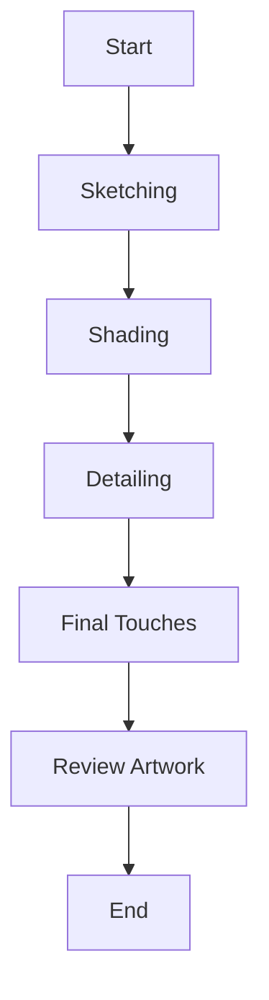
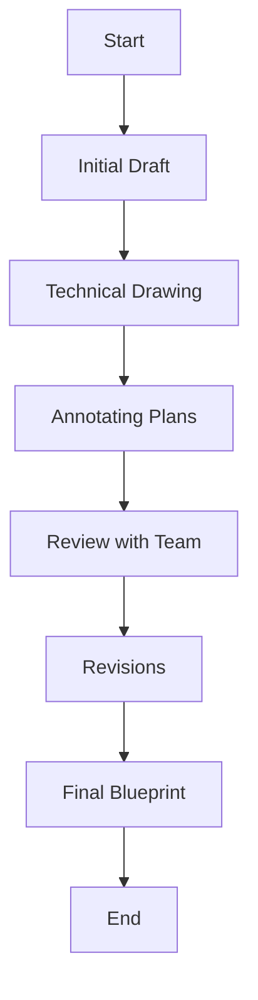
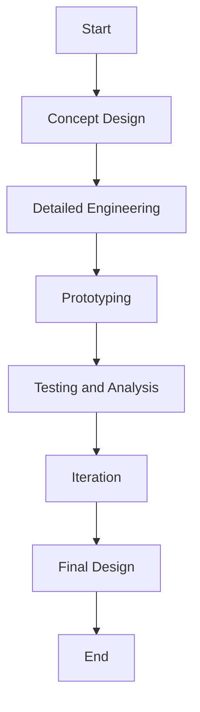

# Pencil Master 2.0 Test Plan


## Table of Contents

1. [Purpose and Scope](#purpose-and-scope)
2. [Stakeholders](#stakeholders)
3. [Test Categories](#test-categories)
4. [Detailed Test Cases](#detailed-test-cases)
5. [Sample Files and Data](#sample-files-and-data)
6. [User Journeys](#user-journeys)
7. [Sign-Off](#sign-off)

## Purpose and Scope

- **Purpose:** Ensure the Pencil Master 2.0 meets all required specifications and quality standards for various professional use cases.
- **Scope:** Includes all aspects of the Pencil Master 2.0, from physical properties to performance during use, focusing on specific professional needs.

## Stakeholders

- **Project Manager:** Responsible for overall project delivery and ensuring milestones are met.
- **Product Owner:** Ensures the product meets market requirements and customer needs.
- **Quality Assurance Team:** Conducts the tests and ensures the product meets quality standards.
- **Legal Team:** Ensures the product and packaging meet all legal requirements.
- **Marketing Team:** Ensures the branding and packaging align with marketing strategies.
- **Design Team:** Provides design specifications and ensures the product meets aesthetic standards.
- **Engineering Team:** Provides technical specifications and supports the testing process.

## Test Categories

- Physical Attributes
- Performance
- Durability
- User Experience
- Safety
- Environmental Impact
- Packaging Verification
- Phalange Analysis

## Detailed Test Cases

```csv
ID,Category,Test Name,Type,Tools,Steps,Expected Result
TC001,Physical Attributes,Measure Length,Physical Measurement,Precision ruler or digital caliper,Measure the length using the specified tools.,Length within 7.5 inches ± 0.1 inches.
TC002,Physical Attributes,Measure Diameter,Physical Measurement,Digital caliper,Measure the diameter at multiple points.,Diameter consistent and within 7 mm ± 0.2 mm.
TC003,Physical Attributes,Weight Check,Physical Measurement,Precision scale,Weigh the pencil using a precision scale.,Weight within 5 grams ± 0.5 grams.
TC004,Performance,Writing Smoothness,User Testing, Automated Testing,High-speed camera, robotic arm,Write on various paper types and analyze smoothness.,Smooth writing without skipping.
TC005,Performance,Graphite Flow Consistency,User Testing, Automated Testing,High-speed camera, robotic arm,Continuous writing and analysis.,Consistent graphite flow without breaks.
TC006,Performance,Darkness of Mark,User Testing, Automated Testing,Image analysis software,Write samples and compare against standard.,Mark within specified darkness range.
TC007,Durability,Graphite Breakage Resistance,Physical Testing,Universal testing machine (UTM),Apply pressure and assess breakage.,Graphite resists breaking under normal pressure.
TC008,Durability,Wood Casing Strength,Physical Testing,Universal testing machine (UTM),Apply pressure and check for splintering.,Wood does not splinter or break under normal use.
TC009,Durability,Impact Resistance,Physical Testing,Drop tester,Drop the pencil from a specified height and inspect.,No significant damage from standard drops.
TC010,Durability,Long-Term Use Consistency,User Testing,High-speed camera,Regular use and evaluation.,Maintains performance over time.
TC011,User Experience,Grip Comfort,User Testing,High-speed camera,Prolonged use and assessment.,Comfortable grip.
TC012,User Experience,Balance and Handling,User Testing,High-speed camera,Various tasks and handling.,Well-balanced and easy to handle.
TC013,Safety,Toxicity Check,Chemical Analysis,Mass spectrometer, gas chromatograph,Analyze materials.,Materials certified non-toxic.
TC014,Safety,Physical Safety,Visual and Tactile Inspection,Manual inspection,Inspect for hazards.,Free of physical hazards.
TC015,Environmental Impact,Sustainability of Wood,Document Review,Manual review,Review certifications and conduct audits.,Wood from sustainable sources.
TC016,Environmental Impact,Recyclability,Material Composition Analysis,Material analyzer,Analyze composition and recycling processes.,Materials recyclable.
TC017,Environmental Impact,Eco-friendliness of Paint and Eraser,Environmental Impact Analysis,Environmental impact analysis software,Perform analysis.,Eco-friendly materials.
TC018,Packaging Verification,Legal Disclaimers and Branding Details,Document Review, Visual Inspection,Manual review,Compare packaging with specifications.,Includes all required disclaimers and details.
TC019,Phalange Analysis,Phalange Analysis After Usage,Biomechanical Analysis,High-speed camera, motion capture sensors,Record and analyze hand movements.,Minimal strain on phalanges.
TC020,Sample Files and Data,Review Toxicity Report,Document Review,Manual review,Check the toxicity report CSV file.,All materials are below the toxicity threshold.
TC021,Sample Files and Data,Analyze Phalange Data,Data Analysis,Statistical software,Analyze phalange data CSV file for force and angle.,Minimal force and consistent angles for comfort.
TC022,Sample Files and Data,Review Video Files,Visual Inspection,Video player,Review video files for writing smoothness, graphite flow, and grip comfort.,Videos demonstrate expected results.
TC023,Sample Files and Data,Verify Supplier Certifications,Document Review,Manual review,Review supplier certifications PDF file.,Certifications confirm sustainable sourcing.
TC024,Sample Files and Data,Check Packaging Photos,Visual Inspection,Image viewer,Review packaging photos ZIP file.,Packaging meets branding and legal requirements.
TC025,User Journeys,Artist Workflow: Sketching,User Testing,Pencil, various paper types,Use the pencil to create initial sketches on different paper types.,Smooth lines, no skipping.
TC026,User Journeys,Artist Workflow: Shading,User Testing,Pencil, various paper types,Apply varying pressure to create shading effects.,Consistent shading without smudging.
TC027,User Journeys,Artist Workflow: Detailing,User Testing,Pencil, various paper types,Use the pencil for intricate details.,Precise lines with good control.
TC028,User Journeys,Artist Workflow: Final Touches,User Testing,Pencil, various paper types,Add highlights and finishing strokes.,Maintains sharpness, no breakage.
TC029,User Journeys,Artist Workflow: Review Artwork,User Testing,Pencil, completed artwork,Assess the overall quality of the drawing.,High-quality, consistent graphite flow.
TC030,User Journeys,Architect Workflow: Initial Draft,User Testing,Pencil, drafting paper,Create rough design sketches.,Clear and precise lines.
TC031,User Journeys,Architect Workflow: Technical Drawing,User Testing,Pencil, drafting paper,Develop detailed architectural plans.,Accurate and sharp lines.
TC032,User Journeys,Architect Workflow: Annotating Plans,User Testing,Pencil, drafted plans,Add notes and dimensions.,Readable and clear annotations.
TC033,User Journeys,Architect Workflow: Review with Team,User Testing,Pencil, drafted plans,Present drafts and make quick adjustments.,Easy to modify and update plans.
TC034,User Journeys,Architect Workflow: Revisions,User Testing,Pencil, drafted plans,Incorporate feedback and refine plans.,Consistent performance over revisions.
TC035,User Journeys,Architect Workflow: Final Blueprint,User Testing,Pencil, final plans,Finalize the detailed architectural plans.,Clear and precise final plans.
TC036,User Journeys,Engineer Workflow: Concept Design,User Testing,Pencil, engineering paper,Create preliminary engineering sketches.,Handles initial design work well.
TC037,User Journeys,Engineer Workflow: Detailed Engineering,User Testing,Pencil, engineering paper,Develop detailed technical drawings.,Precise technical details.
TC038,User Journeys,Engineer Workflow: Prototyping,User Testing,Pencil, engineering paper,Use the drawings to create prototypes.,Durable during prototype creation.
TC039,User Journeys,Engineer Workflow: Testing and Analysis,User Testing,Pencil, engineering paper,Analyze prototypes and make notes.,Clear and precise annotations.
TC040,User Journeys,Engineer Workflow: Iteration,User Testing,Pencil, engineering paper,Refine designs based on test results.,Consistent performance during iterations.
TC041,User Journeys,Engineer Workflow: Final Design,User Testing,Pencil, engineering paper,Finalize the detailed engineering design.,Clear and precise final design.
```

## Sample Files and Data

### Sample CSV Data

#### **toxicity_report.csv**

```csv
Material,Component,Test,Result,Units,Threshold,Pass/Fail
Graphite,Lead,Toxicity,0.01,ppm,0.05,Pass
Wood,Formaldehyde,Toxicity,0.02,ppm,0.1,Pass
Eraser,Phthalates,Toxicity,0.01,ppm,0.1,Pass
Paint,Cadmium,Toxicity,0.005,ppm,0.01,Pass
```

#### **phalange_data.csv**

```csv
Timestamp,Finger,Joint,Angle,Force
0.00,Index,Proximal,10.5,0.2
0.01,Index,Proximal,11.0,0.2
0.02,Index,Proximal,10.8,0.3
0.00,Middle,Proximal,12.5,0.3
0.01,Middle,Proximal,12.7,0.3
0.02,Middle,Proximal,12.6,0.4
```

### Sample Video Files

- **writing_smoothness_video.mp4**: A video recording of a user writing with the Pencil Master 2.0 on different types of paper.
- **graphite_flow_video.mp4

**: A video recording of continuous writing with the Pencil Master 2.0 to analyze graphite flow consistency.
- **grip_comfort_video.mp4**: A video recording of users using the Pencil Master 2.0 for extended periods to assess grip comfort.
- **phalange_analysis_video.mp4**: A video recording of the hand movements of users while using the Pencil Master 2.0, used for biomechanical analysis.

### Sample PDF Files

- **supplier_certifications.pdf**: Document containing certifications from suppliers confirming the sustainability of the wood used in Pencil Master 2.0.
- **packaging_specs.pdf**: Specifications provided by the legal and marketing teams detailing the required legal disclaimers and branding details for the packaging.
- **packaging_photos.zip**: A ZIP file containing photos of the packaging from different angles to verify the presence of legal disclaimers and branding details.

## User Journeys

### Artist Workflow



### Architect Workflow



### Engineer Workflow



### Detailed Workflow for Artists

1. **Sketching**
   - Use Pencil Master 2.0 for initial outlines.
   - Test smoothness and consistency of lines.

2. **Shading**
   - Apply varying pressure for different shading effects.
   - Analyze the uniformity of graphite flow.

3. **Detailing**
   - Focus on intricate details.
   - Check precision and control of the pencil.

4. **Final Touches**
   - Add highlights and finishing strokes.
   - Ensure the pencil maintains sharpness.

5. **Review Artwork**
   - Assess the overall quality of the drawing.
   - Look for any issues in graphite consistency or pencil performance.

### Detailed Workflow for Architects

1. **Initial Draft**
   - Create rough sketches of design concepts.
   - Evaluate ease of use for quick sketches.

2. **Technical Drawing**
   - Develop detailed architectural plans.
   - Test accuracy and sharpness of lines.

3. **Annotating Plans**
   - Add notes and dimensions to drawings.
   - Check clarity and readability of annotations.

4. **Review with Team**
   - Present drafts to the team for feedback.
   - Make quick adjustments as needed.

5. **Revisions**
   - Incorporate feedback and refine the plans.
   - Ensure pencil performance during prolonged use.

6. **Final Blueprint**
   - Finalize the detailed architectural plans.
   - Verify that all annotations and details are clear.

### Detailed Workflow for Engineers

1. **Concept Design**
   - Create preliminary sketches of engineering concepts.
   - Test the pencil's ability to handle initial design work.

2. **Detailed Engineering**
   - Develop detailed technical drawings and specifications.
   - Ensure precision in line work and annotations.

3. **Prototyping**
   - Use the drawings to create prototypes.
   - Test durability and consistency during extended use.

4. **Testing and Analysis**
   - Analyze prototypes and make notes on drawings.
   - Ensure clarity and precision in annotations.

5. **Iteration**
   - Refine designs based on test results.
   - Test the pencil's performance during multiple iterations.

6. **Final Design**
   - Finalize the detailed engineering design.
   - Verify that all technical details are clear and precise.

## Sign-Off

The following stakeholders have reviewed and approved this test plan:

- **Project Manager:** 
  - Name: [Name]
  - Signature: ______________________
  - Date: _______________

- **Product Owner:** 
  - Name: [Name]
  - Signature: ______________________
  - Date: _______________

- **Quality Assurance Lead:** 
  - Name: [Name]
  - Signature: ______________________
  - Date: _______________

- **Legal Representative:** 
  - Name: [Name]
  - Signature: ______________________
  - Date: _______________

- **Marketing Lead:** 
  - Name: [Name]
  - Signature: ______________________
  - Date: _______________

- **Design Lead:** 
  - Name: [Name]
  - Signature: ______________________
  - Date: _______________

- **Engineering Lead:** 
  - Name: [Name]
  - Signature: ______________________
  - Date: _______________